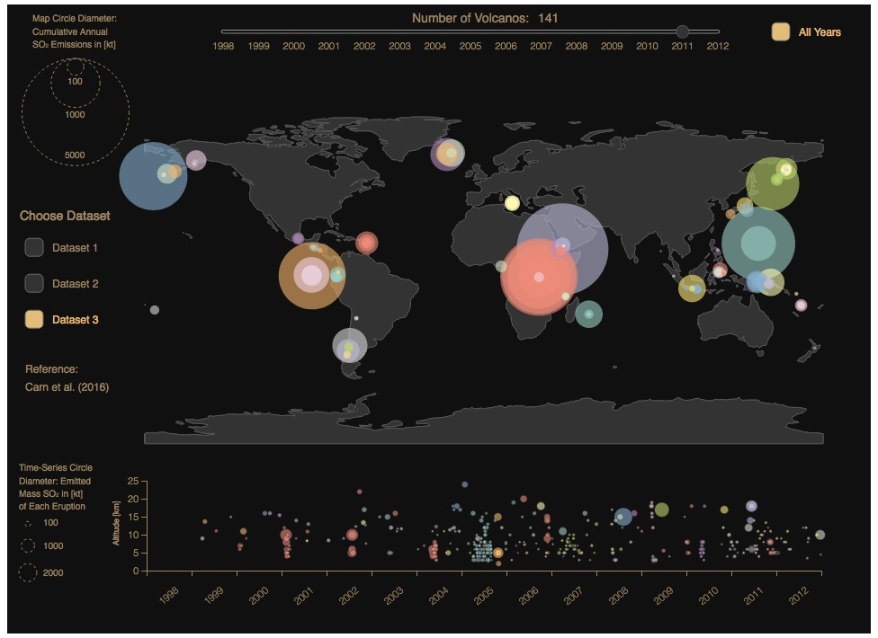

# tar-viz-volc-db
Interactive visualisation of volcanic datasets provided for TAR experiments of the ISA-MIP climate model intercomparison initiative.

Details of data set and purpose of visualisation are described here:
http://www.env.earth/TAR

Schreenshot:

Contact: rene.hommel@web.de
CV: http://www.polynomial.fit
